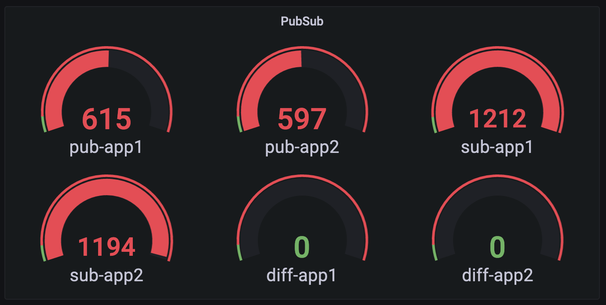

# Running PubSub with distinct Consumer IDs in Dapr

In this scenario we are running two pubsub applications where a pair of publisher/subscriber runs in separate threads.
One application is started 30 seconds earlier than the other.
Publishers send messages to 3 topics. The subscribers are using distinct Consumer IDs and subscribed to these 3 topics.

## Objective

Since the subscribers have different consumer IDs, each of them should receive all messages from both publishers.
We want to verify that:
 - the first subscriber receives all messages from both publishers
 - the second subscriber receives all messages from the second publisher and those messages from the first publisher that have been sent after the second application is instantiated.
 - subscribers don't receive messages from wrong topics

## Running the test

### 1. Setting up testing environment

Follow [there steps](../infra/README.md) to create your testing environment.

### 2. Deploy the applications

#### 2.1. Review/update Dapr component configs

Verify correctness of RabbitMQ URLs in [dapr-pubsub-rabbitmq1.yml](./dapr-pubsub-rabbitmq1.yml) and [dapr-pubsub-rabbitmq2.yml](./dapr-pubsub-rabbitmq2.yml)

#### 2.2. Start the applications

The [start-test.sh](./start-test.sh) script deploys both applications, described in [pubsub1.yml](./pubsub1.yml) and [pubsub2.yml](./pubsub2.yml)
```bash
./start-test.sh
```

### 3. Checking the results

Forward Prometheus port to your local machine

```bash
kubectl port-forward -n monitoring svc/prometheus 9090
```

Check the [Prometheus UI](http://localhost:9090/graph?g0.expr=sum(pub_total%7Berror%3D%22%22%2Cerror!~%22.%2B127.0.0.1%3A50001.%2B%22%7D)%20by%20(pubsub)&g0.tab=1&g0.stacked=0&g0.show_exemplars=0&g0.range_input=1h&g1.expr=sum(sub_total)%20by%20(pubsub)&g1.tab=1&g1.stacked=0&g1.show_exemplars=0&g1.range_input=1h&g2.expr=sum(sub_total%7Bpubsub%3D%22pubsub1%22%7D)%20-%20sum(pub_total%7Bpubsub%3D%22pubsub1%22%2Cerror%3D%22%22%2Cerror!~%22.%2B127.0.0.1%3A50001.%2B%22%7D)%20-%20sum(pub_total%7Bpubsub%3D%22pubsub2%22%2Cerror%3D%22%22%2Cerror!~%22.%2B127.0.0.1%3A50001.%2B%22%7D)&g2.tab=1&g2.stacked=0&g2.show_exemplars=0&g2.range_input=1h&g3.expr=sum(sub_total%7Bpubsub%3D%22pubsub2%22%7D)%20-%202*sum(pub_total%7Bpubsub%3D%22pubsub2%22%2Cerror%3D%22%22%2Cerror!~%22.%2B127.0.0.1%3A50001.%2B%22%7D)&g3.tab=1&g3.stacked=0&g3.show_exemplars=0&g3.range_input=1h&g4.expr=sub_total%7Bmiss!%3D%22%22%7D&g4.tab=1&g4.stacked=0&g4.show_exemplars=0&g4.range_input=1h)

The UI shows 5 panels:
1. number of messages sent by each publisher
2. number of messages received by each subscriber
3. difference in number of expected and received messages by the first subscriber (should be zero)
4. difference in number of expected and received messages by the second subscriber (should be zero)
5. number of mis-delivered messages (should be zero or no metrics)

If you are running Grafana with your Prometheus server as a data source, you can add corresponding [dashboard](./grafana/dashboard.json)

