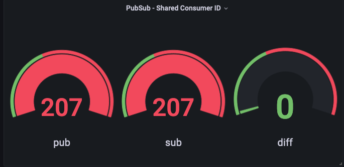

# Running PubSub with shared Consumer ID in Dapr

In this scenario we are running a publisher application and two subscriber applications that share same Consumer ID.
Publishers send messages to 3 topics, to which subscribers are listenning to.

## Objective

Since the subscribers have same consumer ID, they should split the messages among them, i.e. each pubslished message should be received only once by either of the subscribers.
We want to verify that:
 - each pubslished message is received only once
 - subscribers don't receive messages from wrong topics

## Running the test

### 1. Setting up testing environment

Follow [there steps](../infra/README.md) to create your testing environment.

### 2. Deploy the applications

#### 2.1. Review/update Dapr component configs

Verify correctness of RabbitMQ URL in [dapr-pubsub-rabbitmq.yml](./dapr-pubsub-rabbitmq.yml)

#### 2.2. Start the applications

The [start-test.sh](./start-test.sh) script deploys publisher and subscribers, described in [pub.yml](./pub.yml) and [sub.yml](./sub.yml) respectively.
```bash
./start-test.sh
```

### 3. Checking the results

Forward Prometheus port to your local machine

```bash
kubectl port-forward -n monitoring svc/prometheus 9090
```

Check the [Prometheus UI](http://localhost:9090/graph?g0.expr=sum(pub_total%7Berror%3D%22%22%2Cerror!~%22.%2B127.0.0.1%3A50001.%2B%22%7D)&g0.tab=1&g0.stacked=0&g0.show_exemplars=0&g0.range_input=1h&g1.expr=sum(sub_total)&g1.tab=1&g1.stacked=0&g1.show_exemplars=0&g1.range_input=1h&g2.expr=sum(sub_total)%20-%20sum(pub_total%7Berror%3D%22%22%2Cerror!~%22.%2B127.0.0.1%3A50001.%2B%22%7D)&g2.tab=1&g2.stacked=0&g2.show_exemplars=0&g2.range_input=1h&g3.expr=sub_total%7Bmiss!%3D%22%22%7D&g3.tab=1&g3.stacked=0&g3.show_exemplars=0&g3.range_input=1h)

The UI shows 4 panels:
1. number of messages sent by the publisher
2. number of messages received by both subscribers in total
3. difference in number of published and received messages (should be zero)
4. number of mis-delivered messages (should be zero or no metrics)

If you are running Grafana with your Prometheus server as a data source, you can add corresponding [dashboard](./grafana/dashboard.json)

